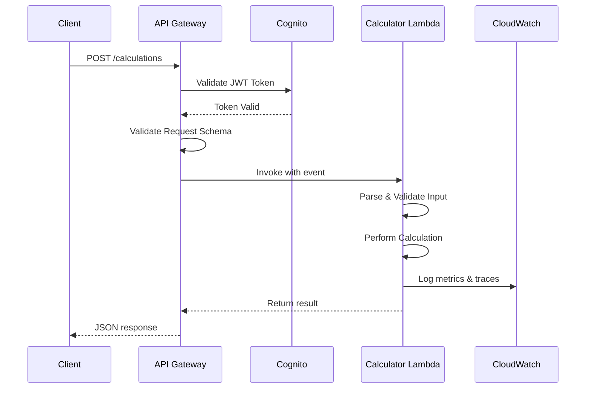

# Design Document

## Overview

The calculator endpoint feature adds a new POST endpoint `/calculations` to the serverless API that performs mathematical operations on arrays of numbers. The implementation follows the existing architectural patterns established in the codebase, including Lambda Powertools for observability, shared utilities for response formatting, and API Gateway integration with Cognito authentication.

The endpoint accepts a JSON payload containing an operation type and an array of numbers, validates the input, performs the requested calculation, and returns the result in a standardized JSON response format. The resource-based path `/calculations` follows REST conventions by treating calculations as resources that can be created.

## Architecture

### High-Level Flow



### Component Architecture

The calculator feature consists of:

1. **API Gateway Endpoint**: `/calculations` POST endpoint with request validation
2. **Lambda Function**: `CalculatorFunction` that processes calculation requests
3. **Shared Utilities**: Reuse existing `apigateway.mjs` and `lambda-powertools.mjs`
4. **OpenAPI Specification**: Schema definitions for request/response validation

## Components and Interfaces

### API Endpoint Specification

**Path**: `/calculations`  
**Method**: POST  
**Authentication**: Cognito JWT (default authorizer)  
**Request Validator**: Validate body, query string parameters, and headers

**Request Body Schema**:
```json
{
  "operation": "addition|subtraction|multiplication|division",
  "numbers": [1, 2, 3, ...]
}
```

**Request Body Properties**:
- `operation` (string, required): One of "addition", "subtraction", "multiplication", "division"
- `numbers` (array of numbers, required): Array of numeric values to perform operation on

**Response Schema** (Success - 200):
```json
{
  "operation": "addition",
  "numbers": [1, 2, 3],
  "result": 6
}
```

**Response Properties**:
- `operation` (string): Echo of the operation performed
- `numbers` (array): Echo of the input numbers
- `result` (number): Calculated result

**Error Response Schema** (400/500):
```json
{
  "message": "Error description"
}
```

### Lambda Function Structure

**Directory**: `src/functions/calculator/`

**Files**:
- `index.mjs`: Main handler function
- `calculator.mjs`: Business logic for calculations
- `tests/index.tests.mjs`: Unit tests for handler
- `tests/calculator.tests.mjs`: Unit tests for calculation logic

**Handler Flow**:
1. Parse event body to extract operation and numbers
2. Validate operation type
3. Delegate to appropriate calculation function
4. Return formatted response with result
5. Handle errors and return appropriate error responses

### Calculation Module

**File**: `src/functions/calculator/calculator.mjs`

**Exported Functions**:

```javascript
export const calculate = (operation, numbers) => {
  // Main entry point that routes to specific operation
}

const add = (numbers) => {
  // Sum all numbers in array
  // Empty array returns 0
}

const subtract = (numbers) => {
  // Subtract subsequent numbers from first
  // Single number returns that number
  // Empty array returns 0
}

const multiply = (numbers) => {
  // Multiply all numbers in array
  // Empty array returns 1
}

const divide = (numbers) => {
  // Divide first number by second
  // Validates exactly 2 numbers
  // Validates second number is not zero
  // Throws error for invalid input
}
```

**Error Handling**:
- Throw descriptive errors for validation failures
- Handler catches errors and returns appropriate HTTP status codes

## Data Models

### Request Model

```typescript
interface CalculateRequest {
  operation: 'addition' | 'subtraction' | 'multiplication' | 'division';
  numbers: number[];
}
```

**Validation Rules**:
- `operation`: Required, must be one of the four supported operations
- `numbers`: Required, must be an array, all elements must be numbers

### Response Model (Success)

```typescript
interface CalculateResponse {
  operation: string;
  numbers: number[];
  result: number;
}
```

### Response Model (Error)

```typescript
interface ErrorResponse {
  message: string;
}
```

**Error Messages**:
- Invalid operation: "Invalid operation type. Supported operations are: addition, subtraction, multiplication, division"
- Division with wrong count: "Division operation requires exactly two numbers"
- Division with too many: "Division operation supports exactly two numbers only"
- Division by zero: "Division by zero is not allowed"
- Generic error: "Something went wrong!"

## Error Handling

### Validation Errors (400 Bad Request)

**API Gateway Level**:
- Missing required fields (operation, numbers)
- Invalid data types (non-array for numbers, non-string for operation)
- Returns API Gateway validation error message

**Lambda Level**:
- Invalid operation type
- Division with incorrect number count
- Division by zero
- Returns custom error message in response body

### Server Errors (500 Internal Server Error)

**Unhandled Exceptions**:
- Unexpected errors during calculation
- Parsing errors
- Returns generic error message: "Something went wrong!"
- Full error logged to CloudWatch with stack trace

### Error Response Pattern

```javascript
try {
  // Validation and calculation logic
  if (invalidCondition) {
    return getResponse(400, { message: 'Specific error message' });
  }
  return getResponse(200, result);
} catch (err) {
  logger.error(err, err.stack);
  return getResponse(500, { message: 'Something went wrong!' });
}
```

## OpenAPI Integration

### Path Definition

Add `/calculations` path to `openapi.yaml`:
- POST operation with `createCalculation` operationId (RESTful naming)
- Tag: "Tool" (consistent with existing endpoints)
- Request body with schema reference
- Response definitions for 200, 400, 403, 500
- Request validator configuration
- Lambda integration using CloudFormation intrinsic function

### Component Schemas

Define reusable schemas in `components/schemas`:
- `calculateRequest`: Request body schema
- `calculateResponse`: Success response schema

### Request Validator

Use existing validator: "Validate body, query string parameters, and headers"

### Gateway Integration

```yaml
x-amazon-apigateway-integration:
  uri:
    Fn::Sub: arn:${AWS::Partition}:apigateway:${AWS::Region}:lambda:path/2015-03-31/functions/${CalculatorFunction.Arn}/invocations
  httpMethod: POST
  type: aws_proxy
```

## SAM Template Configuration

### Function Resource

```yaml
CalculatorFunction:
  Type: AWS::Serverless::Function
  Properties:
    CodeUri: src/functions/calculator
    Events:
      CalculateEvent:
        Type: Api
        Properties:
          RestApiId: !Ref API
          Path: /calculations
          Method: POST
    Policies:
      - AWSLambdaBasicExecutionRole
  Metadata:
    BuildMethod: esbuild
    BuildProperties:
      Format: esm
      Minify: false
      OutExtension:
        - .js=.mjs
      Target: es2020
      Sourcemap: false
      EntryPoints:
        - index.mjs
      Banner:
        - js=import { createRequire } from 'module'; const require = createRequire(import.meta.url);
      External:
        - '@aws-sdk/client-secrets-manager'
```

**Configuration Details**:
- Runtime: Node.js 20.x (from Globals)
- Memory: 768 MB (from Globals)
- Timeout: 10 seconds (from Globals)
- Handler: index.handler (from Globals)
- Environment variables: Inherited from Globals (Powertools config, AWS account ID)
- Build: ESBuild with ES modules format
- IAM: Basic execution role for CloudWatch Logs

## Testing Strategy

### Unit Tests

**Handler Tests** (`tests/index.tests.mjs`):
- Test successful calculations for each operation type
- Test error responses for invalid operations
- Test error responses for division validation failures
- Test error responses for malformed input
- Test that responses include correct status codes and structure

**Calculator Logic Tests** (`tests/calculator.tests.mjs`):
- Test addition with multiple numbers, single number, empty array
- Test subtraction with multiple numbers, single number, empty array
- Test multiplication with multiple numbers, zero, empty array
- Test division with valid input (2 numbers)
- Test division error cases (wrong count, division by zero)
- Test invalid operation type handling

### Test Framework

- **Test Runner**: Mocha
- **Assertions**: Chai (expect syntax)
- **Coverage**: c8
- **Command**: `npm test` runs all tests

### Test Patterns

```javascript
describe('Calculator', () => {
  describe('handler', () => {
    it('Successfully performs addition', async () => {
      const event = {
        body: JSON.stringify({
          operation: 'addition',
          numbers: [1, 2, 3]
        })
      };
      const response = await handler(event);
      expect(response.statusCode).to.equal(200);
      const body = JSON.parse(response.body);
      expect(body.result).to.equal(6);
    });

    it('Returns 400 for division with more than 2 numbers', async () => {
      const event = {
        body: JSON.stringify({
          operation: 'division',
          numbers: [10, 2, 5]
        })
      };
      const response = await handler(event);
      expect(response.statusCode).to.equal(400);
      const body = JSON.parse(response.body);
      expect(body.message).to.include('exactly two numbers');
    });
  });
});
```

### Integration Testing

**Postman Collection**:
- Add calculator endpoint tests to `collection.postman.json`
- Use Portman to generate from OpenAPI spec
- Test with actual deployed API
- Validate authentication flow
- Test all operation types with various inputs
- Verify error responses

## Observability

### Logging

**Lambda Powertools Logger**:
- Structured JSON logs
- Automatic request/response logging (logEvent: true)
- Error logging with stack traces
- Persistent attributes: AWS account ID, region
- Service name: "layerless-esbuild-lambda-api"

**Log Events**:
- Incoming request (automatic via Powertools)
- Calculation operation and result (info level)
- Validation errors (warn level)
- Unhandled errors (error level with stack trace)

### Metrics

**Lambda Powertools Metrics**:
- Namespace: "layerless-esbuild-lambda"
- Default dimensions: AWS account ID, region
- Cold start metrics (automatic)

**Custom Metrics** (optional for future enhancement):
- Calculation count by operation type
- Error count by error type
- Calculation duration

### Tracing

**AWS X-Ray via Powertools Tracer**:
- Automatic Lambda handler tracing
- Subsegments for calculation operations
- Error capture in traces
- Integration with CloudWatch ServiceLens

## Security Considerations

### Authentication & Authorization

- Cognito JWT required for all requests (default authorizer)
- No additional authorization logic needed (all authenticated users can calculate)
- API Gateway handles token validation

### Input Validation

- API Gateway validates request schema (required fields, data types)
- Lambda validates business rules (operation type, division constraints)
- No SQL injection risk (no database operations)
- No command injection risk (pure mathematical operations)

### Error Information Disclosure

- Generic error messages for unexpected errors
- Specific error messages only for validation failures
- No stack traces exposed to clients
- Full error details logged to CloudWatch for debugging

### CORS

- CORS headers included in all responses via shared utility
- Access-Control-Allow-Origin: '*' (consistent with existing endpoints)
- Gateway responses include CORS headers for errors

## Performance Considerations

### Cold Start Optimization

- Layerless design with ESBuild bundling
- Minimal dependencies (only Powertools and Middy)
- ES modules for faster loading
- No external service calls (pure computation)

### Calculation Performance

- All operations are O(n) where n is array length
- No recursion or complex algorithms
- In-memory operations only
- Expected execution time: < 100ms for typical inputs

### Memory Usage

- 768 MB allocated (from Globals)
- Minimal memory footprint (no large data structures)
- No memory leaks (stateless function)

## Future Enhancements

Potential improvements not included in initial implementation:

1. **Additional Operations**: Support for modulo, exponentiation, square root
2. **Precision Control**: Handle floating-point precision issues
3. **Result Rounding**: Option to round results to specific decimal places
4. **Batch Operations**: Support multiple calculations in single request
5. **Operation History**: Store calculation history in DynamoDB
6. **Rate Limiting**: Throttle requests per user
7. **Advanced Metrics**: Track operation usage patterns
8. **Input Limits**: Maximum array size validation
