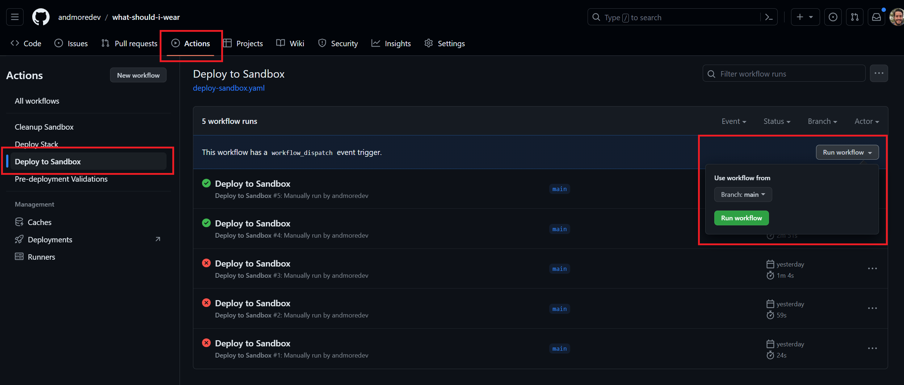

Repository used as an example for the [Drop the layers, bundle up with ESBuild instead](https://andmore.dev/blog/layerless-esbuild-lambda) article.
**Update** - This includes authentication now. This is all explained in [Secure API Gateway with Amazon Cognito using SAM](https://andmore.dev/blog/api-cognito).

# Deploy using the SAM CLI
## Clone/fork the repository
Clone or fork this repository and push it to your own GitHub account.

## Install npm dependencies
```bash
npm install
```
## Build and deploy with sam
Logged in to the account you wish to deploy this follow these steps.

### 1. Build
Build all the artifacts
```bash
sam build
```

### 2. Deploy
Run `sam deploy` with the guided flag to capture the necessary information for the deployment.
```bash
sam deploy --guided
```

# Deploy in your account using the included GitHub workflows
## Clone/fork the repository
Clone or fork this repository and push it to your own GitHub account.

## Setup GitHub environment
1. Create an GitHub environment named *sandbox*
1. Add your Pipeline Execution Role (PIPELINE_EXECUTION_ROLE), CloudFormation Execution Role (CLOUDFORMATION_EXECUTION_ROLE) and a target S3 bucket name for the artifacts (ARTIFACTS_BUCKET_NAME) as secrets. Here is an explanation by [Chris Ebert](https://twitter.com/realchrisebert) on how to set this up.

## Run Deployment
In the Actions in GitHub you can select the *Deploy to Sandbox* Workflow. There will be a button to *Run workflow* where you can now select the branch you wish to deploy.


